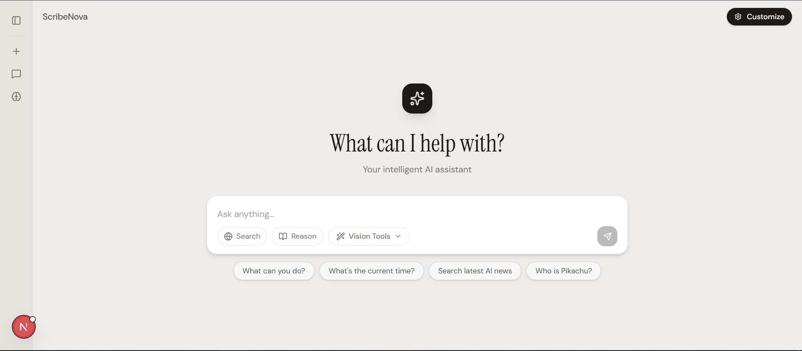
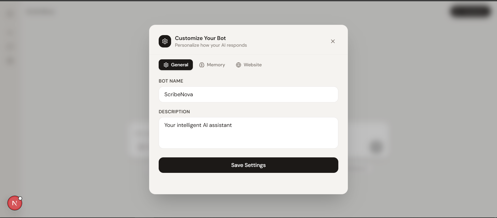
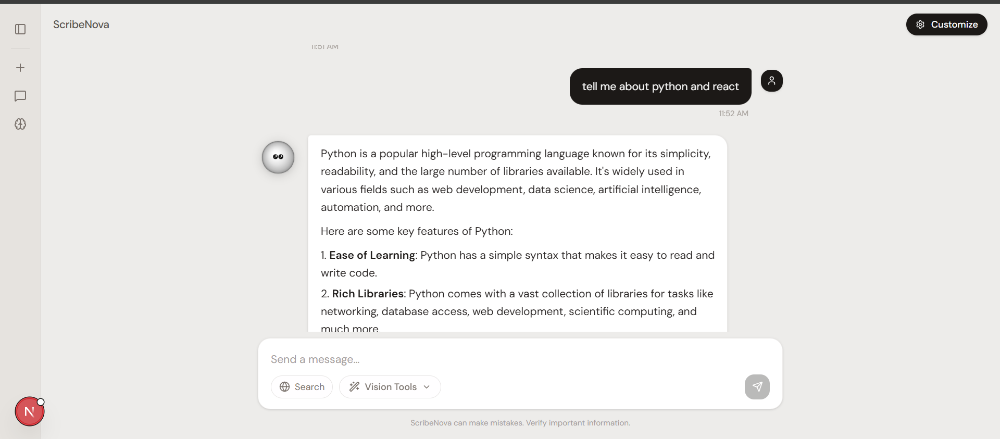
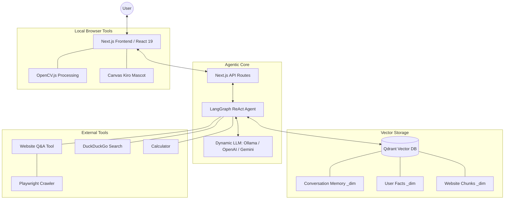

# 🚀 Lumi — Advanced Local-First AI Assistant

[](https://nextjs.org/)
[](https://www.typescriptlang.org/)
[](https://ollama.com/)
[](https://openai.com/)
[](https://deepmind.google/technologies/gemini/)
[](https://qdrant.tech/)
[](https://tailwindcss.com/)

Lumi is a sophisticated, **local-first** AI companion built with the latest web technologies. It combines local inference via **Ollama** (with seamless out-of-the-box support for **OpenAI** and **Gemini** API integration), semantic long-term memory using **Qdrant**, and a beautiful, interactive UI to provide a private and powerful assistant experience directly on your machine.

---

## ✨ Key Features

### 🧠 Intelligent Memory System
- **Conversation Memory**: Remembers past interactions using semantic search, allowing for deep contextual continuity.
- **Custom Fact Store**: Proactively learn and recall specific user-provided facts (preferences, names, projects) to personalize every response.
- **Dynamic Collections**: Automatically creates and separates collections based on the active model's embedding dimensions, preventing DB schema mismatch errors.

### 🌐 Real-time Website Intelligence
- **Deep Crawling**: Built-in Playwright crawler that navigates websites, extracts meaningful content, and indexes it into your vector database.
- **Instant Q&A**: Ask complex questions about any website and get structured, cited answers based on the crawled data.

### 🖼️ Advanced Vision & Image Tools
- **On-device Processing**: Apply filters, edge detection, and enhancements using OpenCV.js directly in the browser.
- **Vision Helpers**: Use AI to analyze and describe uploaded images (requires vision-capable local or cloud models).

### 🎨 Interactive Kiro Mascot
- **Canvas-Rendered Avatar**: Meet Kiro, your animated assistant rendered with high-performance canvas physics.
- **Emotional Intelligence**: Kiro reacts to chat states—thinking, sleeping, being happy, or surprised—making the interaction feel alive.

---

## 📸 Demo

| Chat UI | Customization | Output |
| :---: | :---: | :---: |
|  |  |  |

---

## 🏗️ System Architecture

Lumi utilizes a multi-layered agentic architecture designed for privacy and flexibility.



### Data Flow Execution:
1.  **Input**: User sends a message via the **React 19** interface.
2.  **Context Retrieval**: The **LangGraph** agent queries **Qdrant** for relevant past conversations and user facts.
3.  **Reasoning**: The active **LLM** processes the combined context and decides whether to use a tool (e.g., search or crawl).
4.  **Action**: If a tool is called, the system executes it (e.g., **Playwright** crawls a site) and feeds the results back.
5.  **Generation**: The final response is generated, sanitized, and streamed back to the UI.

---

## 📁 Project Structure

```text
llm-next-app/
├── app/                    # Next.js App Router
├── lib/                    # Core Logic & Utilities
│   ├── agent.ts            # LangChain/LangGraph Agent Definition
│   ├── crawler.ts          # Playwright Web Crawler
│   ├── llm.ts              # Dynamic LLM & Embeddings Selector
│   ├── imageProcessing.ts  # OpenCV.js Vision Tools
│   ├── vectorMemory.ts     # Conversation Persistence
│   ├── customMemory.ts     # User Fact Management
│   └── tools.ts            # Tool Definitions (Search, Calculator, etc.)
├── public/                 # Static Assets & Demo Images
├── .env.example            # Environment Variable Template
├── SYSTEM.md               # Deep Technical Reference
└── package.json            # Dependencies & Scripts
```

---

## 🛠️ Tech Stack

- **Frontend**: Next.js 16, TypeScript, Tailwind CSS 4, Framer Motion
- **AI Core**: LangChain, LangGraph, Ollama, OpenAI, Gemini
- **Database**: Qdrant (Vector Search)
- **Scraping**: Playwright, Cheerio
- **Vision**: OpenCV.js

---

## 🏁 Getting Started

### 1. Prerequisites
- **Node.js** (v20.x+)
- **Ollama**: [Download](https://ollama.com/download) (Required for local-first operations)
- **Docker**: (Recommended for running Qdrant)

### 2. Setup Ollama (If running fully locally)
```bash
ollama pull qwen2.5:1.5b
ollama pull nomic-embed-text
```

### 3. Run Qdrant
```bash
docker run -p 6333:6333 -v $(pwd)/qdrant_storage:/qdrant/storage qdrant/qdrant
```

### 4. Installation & Configuration
Configure your key settings in `.env.local` to toggle between local Ollama and Cloud APIs:
```bash
npm install
npx playwright install chromium
cp .env.example .env.local
# Edit .env.local to configure Ollama, OpenAI, or Gemini keys
npm run dev
```

---

Built with ❤️ by the AI Community.
